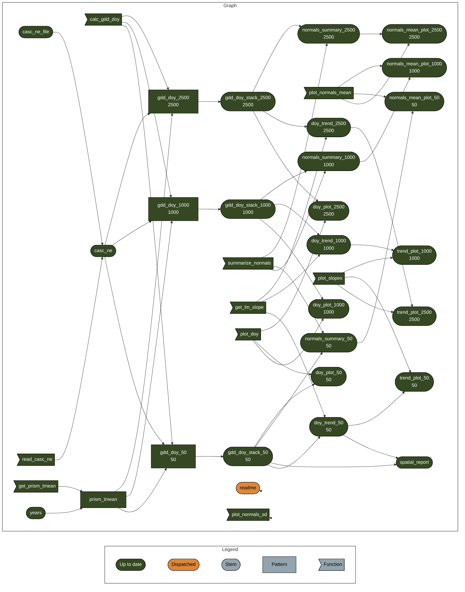

<!-- README.md is generated from README.Qmd. Please edit that file -->

# cales-thermal-calendars

<!-- badges: start -->

<!-- badges: end -->

The goal of cales-thermal-calendars is to …

## Reproducibility

### `renv`

This project uses
[`renv`](https://rstudio.github.io/renv/articles/renv.html) for package
management. When opening this repo as an RStudio Project for the first
time, `renv` should automatically install itself and prompt you to run
`renv::restore()` to install all package dependencies.

### `targets`

This project uses the [`targets`
package](https://docs.ropensci.org/targets/) for workflow management.
Run `targets::tar_make()` from the console to run the workflow and
reproduce all results. The graph below shows the workflow:

------------------------------------------------------------------------

Developed in collaboration with the University of Arizona [CCT Data
Science](https://datascience.cct.arizona.edu/) group.
