<!-- README.md is generated from README.Qmd. Please edit that file -->

# Estimating trends in phenology

<!-- badges: start -->

<!-- badges: end -->

The goal of this project is to estimate spatial and temporal trends in
phenology in the Northeastern US using
[PRISM](https://prism.oregonstate.edu/) temperature data. This
analytical pipeline downloads daily data, calculates growing degree days
(GDD) for each day, and then finds the day of year (DOY) that certain
threshold GDD are reached for this region. It then uses DOY as a
response variable in pixel-wise linear regressions to explore
spatio-temporal trends.

## Reproducibility

This workflow requires a lot of computational power and disk space.
Currently it runs on a Jetstream2 instance with 16 cores and 60GB of ram
on a 500GB disk. Even then, the disk occasionally fills up and the temp
directory needs to be manually cleared out as intermediate tiff files
accumulate. I’ve used a `.Renviron` file to set the `TMPDIR` variable to
make sure `tmpdir()` is on a large enough attached volume rather than
the root disk, which for Jetstream2 is only 50GB.

This project was created with R version 4.4.2.

### `renv`

This project uses
[`renv`](https://rstudio.github.io/renv/articles/renv.html) for package
management. When opening this repo as an RStudio Project for the first
time, `renv` should automatically install itself and prompt you to run
`renv::restore()` to install all package dependencies. If you have any
issues with `renv::restore()`, you may want to ensure you are using the
same version of R (4.4.2)—[rig](https://github.com/r-lib/rig) is an
excellent tool for managing different R versions.

### `targets`

This project uses the [`targets`
package](https://docs.ropensci.org/targets/) for workflow management.
Run `targets::tar_make()` from the console to run the workflow and
reproduce all results. The graph below shows the workflow:

qs2 0.1.3

``` mermaid
graph LR
  style Legend fill:#FFFFFF00,stroke:#000000;
  style Graph fill:#FFFFFF00,stroke:#000000;
  subgraph Legend
    xf1522833a4d242c5(["Up to date"]):::uptodate
    xb6630624a7b3aa0f(["Dispatched"]):::dispatched
    xd03d7c7dd2ddda2b(["Regular target"]):::none
    x6f7e04ea3427f824["Dynamic branches"]:::none
  end
  subgraph Graph
    direction LR
    xdc621d8734e6de6d(["doy_summary_50"]):::uptodate --> x11c2bf776c83b19c(["count_plot"]):::uptodate
    xc884cdd4fb17c69f(["doy_summary_1950"]):::uptodate --> x11c2bf776c83b19c(["count_plot"]):::uptodate
    xd36e999b706381d6(["doy_summary_650"]):::uptodate --> x11c2bf776c83b19c(["count_plot"]):::uptodate
    xd187396e35b9df6a(["doy_summary_2500"]):::uptodate --> x11c2bf776c83b19c(["count_plot"]):::uptodate
    xe7a2595a28ea2e04(["doy_summary_1250"]):::uptodate --> x11c2bf776c83b19c(["count_plot"]):::uptodate
    x73ccc223e5bb7e64(["roi"]):::uptodate --> x11c2bf776c83b19c(["count_plot"]):::uptodate
    xe3bc9075e32f80ca(["doy_summary_350"]):::uptodate --> x11c2bf776c83b19c(["count_plot"]):::uptodate
    x3290bd5727894db5(["stack_1250"]):::uptodate --> xe7a2595a28ea2e04(["doy_summary_1250"]):::uptodate
    x8aa20a6b22429bc6(["stack_1950"]):::uptodate --> xc884cdd4fb17c69f(["doy_summary_1950"]):::uptodate
    x9bfde4bdb66389ab(["stack_2500"]):::uptodate --> xd187396e35b9df6a(["doy_summary_2500"]):::uptodate
    xc842f879425cacb9(["stack_350"]):::uptodate --> xe3bc9075e32f80ca(["doy_summary_350"]):::uptodate
    xff5a5197cb4eb936(["stack_50"]):::uptodate --> xdc621d8734e6de6d(["doy_summary_50"]):::uptodate
    x98420a84329bc56b(["stack_650"]):::uptodate --> xd36e999b706381d6(["doy_summary_650"]):::uptodate
    x73ccc223e5bb7e64(["roi"]):::uptodate --> xc8e128aab3cd4a9e["gdd_doy_1250"]:::uptodate
    xb76c0bbea0c751b0["prism_tmax"]:::uptodate --> xc8e128aab3cd4a9e["gdd_doy_1250"]:::uptodate
    xcaf68fce9acaa5b6["prism_tmin"]:::uptodate --> xc8e128aab3cd4a9e["gdd_doy_1250"]:::uptodate
    xcaf68fce9acaa5b6["prism_tmin"]:::uptodate --> x2fee061101c79ea2["gdd_doy_1950"]:::uptodate
    xb76c0bbea0c751b0["prism_tmax"]:::uptodate --> x2fee061101c79ea2["gdd_doy_1950"]:::uptodate
    x73ccc223e5bb7e64(["roi"]):::uptodate --> x2fee061101c79ea2["gdd_doy_1950"]:::uptodate
    x73ccc223e5bb7e64(["roi"]):::uptodate --> x28c62ae9542e7849["gdd_doy_2500"]:::uptodate
    xb76c0bbea0c751b0["prism_tmax"]:::uptodate --> x28c62ae9542e7849["gdd_doy_2500"]:::uptodate
    xcaf68fce9acaa5b6["prism_tmin"]:::uptodate --> x28c62ae9542e7849["gdd_doy_2500"]:::uptodate
    xcaf68fce9acaa5b6["prism_tmin"]:::uptodate --> x2d1ead242fc1f865["gdd_doy_350"]:::uptodate
    xb76c0bbea0c751b0["prism_tmax"]:::uptodate --> x2d1ead242fc1f865["gdd_doy_350"]:::uptodate
    x73ccc223e5bb7e64(["roi"]):::uptodate --> x2d1ead242fc1f865["gdd_doy_350"]:::uptodate
    xb76c0bbea0c751b0["prism_tmax"]:::uptodate --> x786a1a0a06ddc553["gdd_doy_50"]:::uptodate
    xcaf68fce9acaa5b6["prism_tmin"]:::uptodate --> x786a1a0a06ddc553["gdd_doy_50"]:::uptodate
    x73ccc223e5bb7e64(["roi"]):::uptodate --> x786a1a0a06ddc553["gdd_doy_50"]:::uptodate
    xcaf68fce9acaa5b6["prism_tmin"]:::uptodate --> x6672cfab7f0558ba["gdd_doy_650"]:::uptodate
    xb76c0bbea0c751b0["prism_tmax"]:::uptodate --> x6672cfab7f0558ba["gdd_doy_650"]:::uptodate
    x73ccc223e5bb7e64(["roi"]):::uptodate --> x6672cfab7f0558ba["gdd_doy_650"]:::uptodate
    xe7a2595a28ea2e04(["doy_summary_1250"]):::uptodate --> x9a95e37bbec60034(["linear_slopes_plot"]):::uptodate
    xd187396e35b9df6a(["doy_summary_2500"]):::uptodate --> x9a95e37bbec60034(["linear_slopes_plot"]):::uptodate
    xdc621d8734e6de6d(["doy_summary_50"]):::uptodate --> x9a95e37bbec60034(["linear_slopes_plot"]):::uptodate
    xc884cdd4fb17c69f(["doy_summary_1950"]):::uptodate --> x9a95e37bbec60034(["linear_slopes_plot"]):::uptodate
    xe3bc9075e32f80ca(["doy_summary_350"]):::uptodate --> x9a95e37bbec60034(["linear_slopes_plot"]):::uptodate
    xd36e999b706381d6(["doy_summary_650"]):::uptodate --> x9a95e37bbec60034(["linear_slopes_plot"]):::uptodate
    x73ccc223e5bb7e64(["roi"]):::uptodate --> x9a95e37bbec60034(["linear_slopes_plot"]):::uptodate
    xff5a5197cb4eb936(["stack_50"]):::uptodate --> x41b128208ccec715(["poi_pred_doy"]):::uptodate
    xc842f879425cacb9(["stack_350"]):::uptodate --> x41b128208ccec715(["poi_pred_doy"]):::uptodate
    x556077819df2ba0d(["poi"]):::uptodate --> x41b128208ccec715(["poi_pred_doy"]):::uptodate
    x98420a84329bc56b(["stack_650"]):::uptodate --> x41b128208ccec715(["poi_pred_doy"]):::uptodate
    x8aa20a6b22429bc6(["stack_1950"]):::uptodate --> x41b128208ccec715(["poi_pred_doy"]):::uptodate
    x3290bd5727894db5(["stack_1250"]):::uptodate --> x41b128208ccec715(["poi_pred_doy"]):::uptodate
    x9bfde4bdb66389ab(["stack_2500"]):::uptodate --> x41b128208ccec715(["poi_pred_doy"]):::uptodate
    x41b128208ccec715(["poi_pred_doy"]):::uptodate --> xbd115849bddb4a76(["poi_shifts_plot"]):::uptodate
    x73ccc223e5bb7e64(["roi"]):::uptodate --> xbd115849bddb4a76(["poi_shifts_plot"]):::uptodate
    x4a0f84ca502caa8d(["poi_stats_1950"]):::uptodate --> x7a722b64ce2ed1a1(["poi_stats"]):::uptodate
    xbdede1d17e2cddbb(["poi_stats_2500"]):::uptodate --> x7a722b64ce2ed1a1(["poi_stats"]):::uptodate
    x585c954b4e620bc6(["poi_stats_50"]):::uptodate --> x7a722b64ce2ed1a1(["poi_stats"]):::uptodate
    x6fbb12a3bc31060f(["poi_stats_1250"]):::uptodate --> x7a722b64ce2ed1a1(["poi_stats"]):::uptodate
    x87ab2591407fd72c(["poi_stats_650"]):::uptodate --> x7a722b64ce2ed1a1(["poi_stats"]):::uptodate
    xc303273133d8a2cf(["poi_stats_350"]):::uptodate --> x7a722b64ce2ed1a1(["poi_stats"]):::uptodate
    xe7a2595a28ea2e04(["doy_summary_1250"]):::uptodate --> x6fbb12a3bc31060f(["poi_stats_1250"]):::uptodate
    x556077819df2ba0d(["poi"]):::uptodate --> x6fbb12a3bc31060f(["poi_stats_1250"]):::uptodate
    x556077819df2ba0d(["poi"]):::uptodate --> x4a0f84ca502caa8d(["poi_stats_1950"]):::uptodate
    xc884cdd4fb17c69f(["doy_summary_1950"]):::uptodate --> x4a0f84ca502caa8d(["poi_stats_1950"]):::uptodate
    xd187396e35b9df6a(["doy_summary_2500"]):::uptodate --> xbdede1d17e2cddbb(["poi_stats_2500"]):::uptodate
    x556077819df2ba0d(["poi"]):::uptodate --> xbdede1d17e2cddbb(["poi_stats_2500"]):::uptodate
    x556077819df2ba0d(["poi"]):::uptodate --> xc303273133d8a2cf(["poi_stats_350"]):::uptodate
    xe3bc9075e32f80ca(["doy_summary_350"]):::uptodate --> xc303273133d8a2cf(["poi_stats_350"]):::uptodate
    xdc621d8734e6de6d(["doy_summary_50"]):::uptodate --> x585c954b4e620bc6(["poi_stats_50"]):::uptodate
    x556077819df2ba0d(["poi"]):::uptodate --> x585c954b4e620bc6(["poi_stats_50"]):::uptodate
    xd36e999b706381d6(["doy_summary_650"]):::uptodate --> x87ab2591407fd72c(["poi_stats_650"]):::uptodate
    x556077819df2ba0d(["poi"]):::uptodate --> x87ab2591407fd72c(["poi_stats_650"]):::uptodate
    xf9ac23fbc741da6f(["years"]):::uptodate --> xb76c0bbea0c751b0["prism_tmax"]:::uptodate
    xf9ac23fbc741da6f(["years"]):::uptodate --> xcaf68fce9acaa5b6["prism_tmin"]:::uptodate
    xd187396e35b9df6a(["doy_summary_2500"]):::uptodate --> x1a7be1bbbb0646ca(["sd_plot"]):::uptodate
    xdc621d8734e6de6d(["doy_summary_50"]):::uptodate --> x1a7be1bbbb0646ca(["sd_plot"]):::uptodate
    xe3bc9075e32f80ca(["doy_summary_350"]):::uptodate --> x1a7be1bbbb0646ca(["sd_plot"]):::uptodate
    xd36e999b706381d6(["doy_summary_650"]):::uptodate --> x1a7be1bbbb0646ca(["sd_plot"]):::uptodate
    x73ccc223e5bb7e64(["roi"]):::uptodate --> x1a7be1bbbb0646ca(["sd_plot"]):::uptodate
    xe7a2595a28ea2e04(["doy_summary_1250"]):::uptodate --> x1a7be1bbbb0646ca(["sd_plot"]):::uptodate
    xc884cdd4fb17c69f(["doy_summary_1950"]):::uptodate --> x1a7be1bbbb0646ca(["sd_plot"]):::uptodate
    xd187396e35b9df6a(["doy_summary_2500"]):::uptodate --> xeb357bf500cb426f(["slope_differences"]):::uptodate
    xc884cdd4fb17c69f(["doy_summary_1950"]):::uptodate --> xeb357bf500cb426f(["slope_differences"]):::uptodate
    xe7a2595a28ea2e04(["doy_summary_1250"]):::uptodate --> xeb357bf500cb426f(["slope_differences"]):::uptodate
    xd36e999b706381d6(["doy_summary_650"]):::uptodate --> xeb357bf500cb426f(["slope_differences"]):::uptodate
    xdc621d8734e6de6d(["doy_summary_50"]):::uptodate --> xeb357bf500cb426f(["slope_differences"]):::uptodate
    xe3bc9075e32f80ca(["doy_summary_350"]):::uptodate --> xeb357bf500cb426f(["slope_differences"]):::uptodate
    xeb357bf500cb426f(["slope_differences"]):::uptodate --> x37fe5b550c0a1008(["slope_differences_plot"]):::uptodate
    x73ccc223e5bb7e64(["roi"]):::uptodate --> x37fe5b550c0a1008(["slope_differences_plot"]):::uptodate
    xc8e128aab3cd4a9e["gdd_doy_1250"]:::uptodate --> x3290bd5727894db5(["stack_1250"]):::uptodate
    x2fee061101c79ea2["gdd_doy_1950"]:::uptodate --> x8aa20a6b22429bc6(["stack_1950"]):::uptodate
    x28c62ae9542e7849["gdd_doy_2500"]:::uptodate --> x9bfde4bdb66389ab(["stack_2500"]):::uptodate
    x2d1ead242fc1f865["gdd_doy_350"]:::uptodate --> xc842f879425cacb9(["stack_350"]):::uptodate
    x786a1a0a06ddc553["gdd_doy_50"]:::uptodate --> xff5a5197cb4eb936(["stack_50"]):::uptodate
    x6672cfab7f0558ba["gdd_doy_650"]:::uptodate --> x98420a84329bc56b(["stack_650"]):::uptodate
    xe7a2595a28ea2e04(["doy_summary_1250"]):::uptodate --> x000fd996de9c9b5d(["summary_plot"]):::uptodate
    xd187396e35b9df6a(["doy_summary_2500"]):::uptodate --> x000fd996de9c9b5d(["summary_plot"]):::uptodate
    x73ccc223e5bb7e64(["roi"]):::uptodate --> x000fd996de9c9b5d(["summary_plot"]):::uptodate
    xd36e999b706381d6(["doy_summary_650"]):::uptodate --> x000fd996de9c9b5d(["summary_plot"]):::uptodate
    xdc621d8734e6de6d(["doy_summary_50"]):::uptodate --> x000fd996de9c9b5d(["summary_plot"]):::uptodate
    xc884cdd4fb17c69f(["doy_summary_1950"]):::uptodate --> x000fd996de9c9b5d(["summary_plot"]):::uptodate
    xe3bc9075e32f80ca(["doy_summary_350"]):::uptodate --> x000fd996de9c9b5d(["summary_plot"]):::uptodate
    x21512ad81bd47b85(["summary_summary_1250"]):::uptodate --> xeb07a0ecc48d018b(["summary_summary"]):::uptodate
    x22d1d76737e8c96c(["summary_summary_1950"]):::uptodate --> xeb07a0ecc48d018b(["summary_summary"]):::uptodate
    x98d5cb9b25df8fa2(["summary_summary_2500"]):::uptodate --> xeb07a0ecc48d018b(["summary_summary"]):::uptodate
    x482d008952893a57(["summary_summary_350"]):::uptodate --> xeb07a0ecc48d018b(["summary_summary"]):::uptodate
    xd673ca3454c59fd6(["summary_summary_50"]):::uptodate --> xeb07a0ecc48d018b(["summary_summary"]):::uptodate
    x8817687a9adb871f(["summary_summary_650"]):::uptodate --> xeb07a0ecc48d018b(["summary_summary"]):::uptodate
    xe7a2595a28ea2e04(["doy_summary_1250"]):::uptodate --> x21512ad81bd47b85(["summary_summary_1250"]):::uptodate
    xc884cdd4fb17c69f(["doy_summary_1950"]):::uptodate --> x22d1d76737e8c96c(["summary_summary_1950"]):::uptodate
    xd187396e35b9df6a(["doy_summary_2500"]):::uptodate --> x98d5cb9b25df8fa2(["summary_summary_2500"]):::uptodate
    xe3bc9075e32f80ca(["doy_summary_350"]):::uptodate --> x482d008952893a57(["summary_summary_350"]):::uptodate
    xdc621d8734e6de6d(["doy_summary_50"]):::uptodate --> xd673ca3454c59fd6(["summary_summary_50"]):::uptodate
    xd36e999b706381d6(["doy_summary_650"]):::uptodate --> x8817687a9adb871f(["summary_summary_650"]):::uptodate
    xc11069275cfeb620(["readme"]):::dispatched
  end
  classDef uptodate stroke:#000000,color:#ffffff,fill:#354823;
  classDef dispatched stroke:#000000,color:#000000,fill:#DC863B;
  classDef none stroke:#000000,color:#000000,fill:#94a4ac;
```

------------------------------------------------------------------------

Developed in collaboration with the University of Arizona [CCT Data
Science](https://datascience.cct.arizona.edu/) group.
