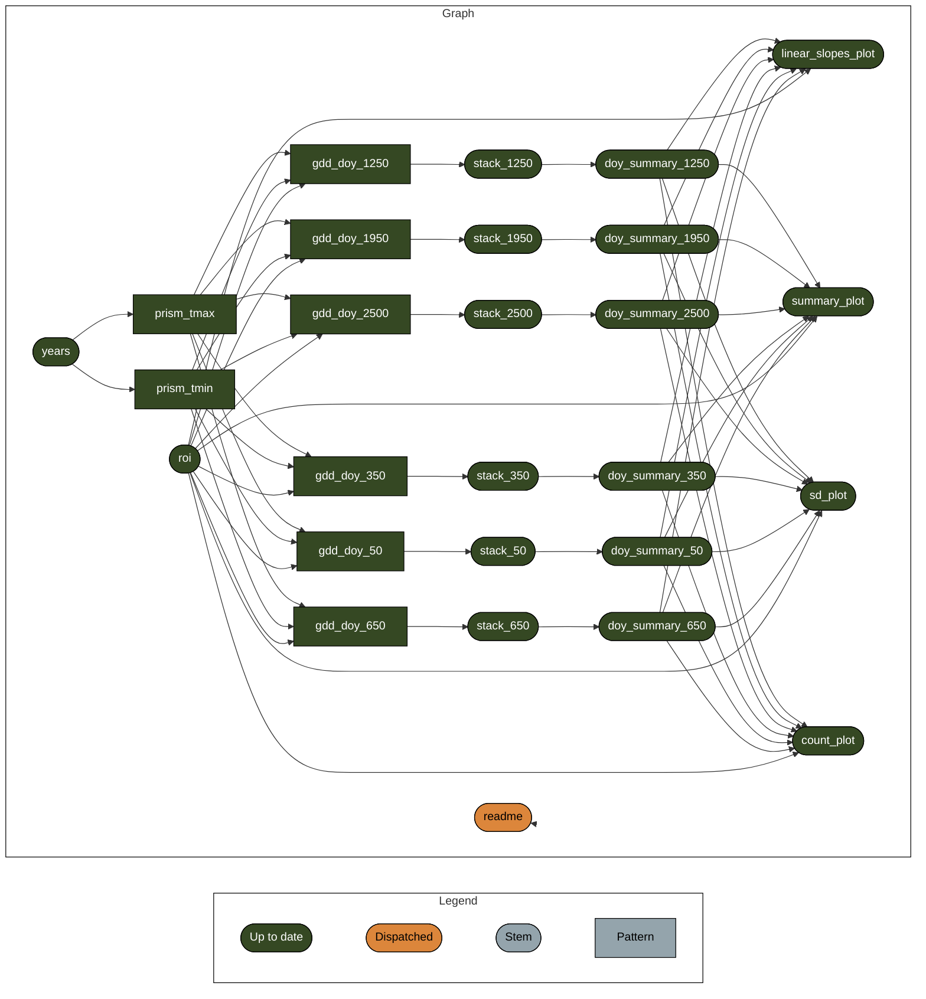

<!-- README.md is generated from README.Qmd. Please edit that file -->

# Estimating trends in phenology

<!-- badges: start -->

<!-- badges: end -->

The goal of this project is to estimate spatial and temporal trends in
phenology in the Northeastern US using
[PRISM](https://prism.oregonstate.edu/) temperature data. This
analytical pipeline downloads daily data, calculates growing degree days
(GDD) for each day, and then finds the day of year (DOY) that certain
threshold GDD are reached for this region. It then uses DOY as a
response variable in a series of generalized additive models to estimate
spatio-temporal trends.

Report of work in progress:
<https://usa-npn.github.io/thermal-trends/spatial-trends-report.html>

## Reproducibility

This workflow requires a lot of computational power and disk space.
Currently it runs on a Jetstream2 instance with 16 cores and 60GB of ram
on a 500GB disk. Even then, the disk occasionally fills up and the temp
directory needs to be manually cleared out as intermediate tiff files
accumulate. I’ve used a `.Renviron` file to set the `TMPDIR` variable to
make sure `tmpdir()` is on a large enough attached volume rather than
the root disk, which for Jetstream2 is only 50GB.

### `renv`

This project uses
[`renv`](https://rstudio.github.io/renv/articles/renv.html) for package
management. When opening this repo as an RStudio Project for the first
time, `renv` should automatically install itself and prompt you to run
`renv::restore()` to install all package dependencies.

### `targets`

This project uses the [`targets`
package](https://docs.ropensci.org/targets/) for workflow management.
Run `targets::tar_make()` from the console or from the HPC run
`sbatch run.sh` to run the workflow and reproduce all results. The graph
below shows the workflow:

qs2 0.1.3

------------------------------------------------------------------------

Developed in collaboration with the University of Arizona [CCT Data
Science](https://datascience.cct.arizona.edu/) group.
