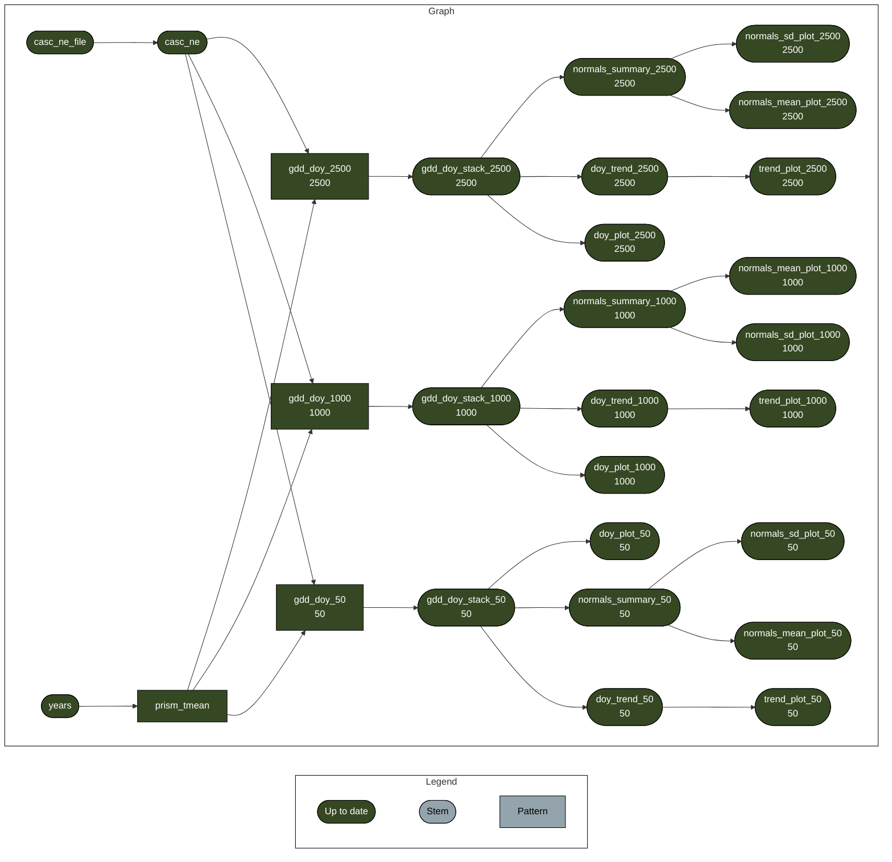

<!-- README.md is generated from README.Qmd. Please edit that file -->

# Estimating trends in phenology

<!-- badges: start -->

<!-- badges: end -->

The goal of this project is to estimate spatial and temporal trends in
phenology in the Northeastern US using
[PRISM](https://prism.oregonstate.edu/) temperature data. This
analytical pipeline downloads daily data, calculates growing degree days
(GDD) for each day, and then finds the day of year (DOY) that certain
threshold GDD are reached for this region. Products will include rasters
of mean DOY for a variety of GDD thresholds over the normals period
(1991-2020), and rasters of estimated rates of change in DOY for these
thresholds.

<!--This is a collaboration between USA-NPN, USDA, the NY Phenology Project, and University of Arizona CCT Data Science.-->
<!--# I'm not 100% sure about this, so I'll leave commented out for now -->

Report of work in progress:
<https://usa-npn.github.io/cales-thermal-calendars/spatial-trends-report.html>

## Reproducibility

### `renv`

This project uses
[`renv`](https://rstudio.github.io/renv/articles/renv.html) for package
management. When opening this repo as an RStudio Project for the first
time, `renv` should automatically install itself and prompt you to run
`renv::restore()` to install all package dependencies.

### `targets`

This project uses the [`targets`
package](https://docs.ropensci.org/targets/) for workflow management.
Run `targets::tar_make()` from the console to run the workflow and
reproduce all results. The graph below shows the workflow:

------------------------------------------------------------------------

Developed in collaboration with the University of Arizona [CCT Data
Science](https://datascience.cct.arizona.edu/) group.
